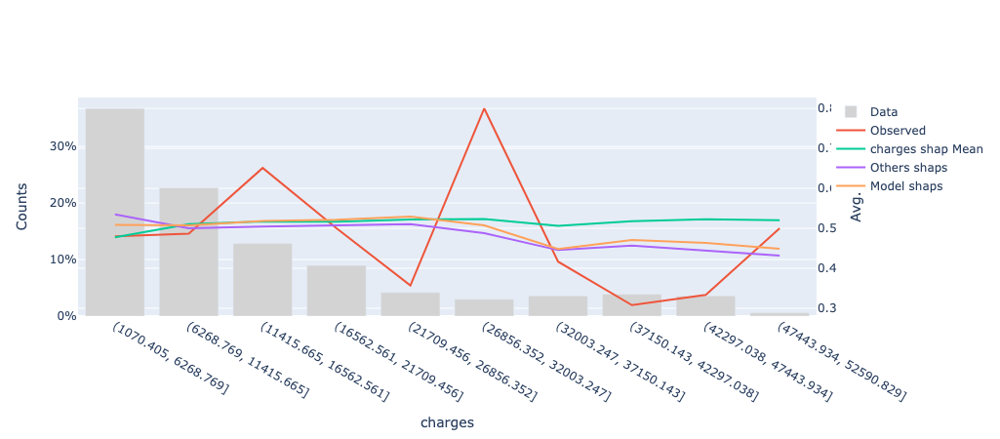
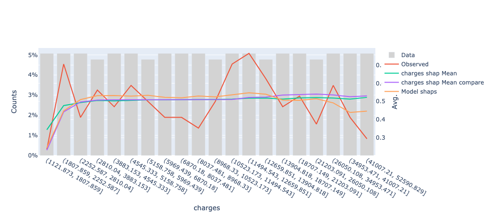
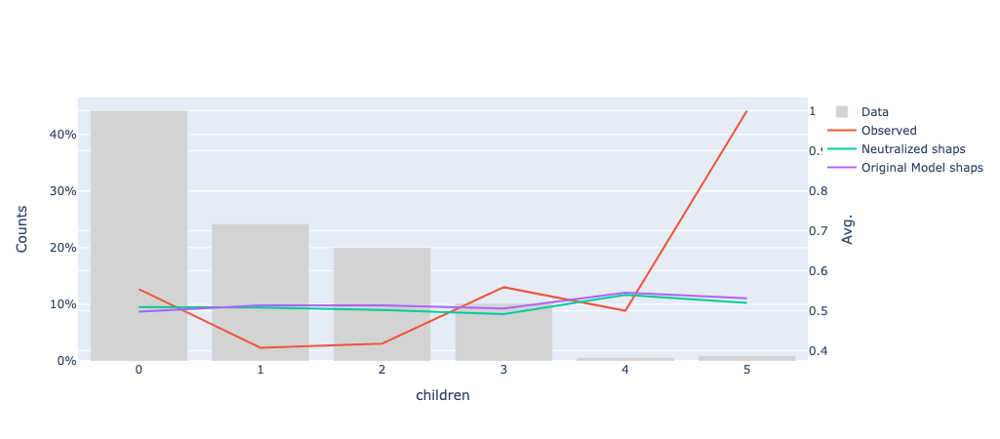

# This part of the project documentation focuses on explaining how the code should be used.

## Get you first aprofs object up

The initial idea of the project was to create a structure that contains all the information needed to use the **shapley values**
along side with you calibration data to get the results you need.

Once instantiated this object with all the proper inputs, we just need to use the correct methods to get our results.

It's very important to get the shapley values calculated before using the aprofs object. I've added some wrapper method called **calculate_shaps** that will help you you bring your own model.

To get the shapley table you just used some of **SHAP package** functionality like tje one you can see below:

``` py  title="TreeExplainer"
    shap_explainer = TreeExplainer(model) # Shap explainer for tree models
    shap_valid = shap_explainer.shap_values(data) # get you sdapley values for your data
    shap_expected_value = shap_explainer.expected_value # averaga shapley value
```

Please reach to the [API](api.md) to get all the details of how to create the object and use the method. Basically you need the **calibration** data, the **target column** for that data and an ML **model** that can be scored on the calibration data.
A structural detail is that the model will not be saved inside the aprofs object. I didn't want to bloat the object more than needed.

```py
from aprofs import code
from apros.models import ClassificationLogisticLink

# Instantiate the type of model/link that you used for training
logit_model = ClassificationLogisticLink()


aprofs_obj = code.Aprofs(X_calibration, y_target_calibration, link_model=logit_model)
```

In this example the link logit model its used by AProfs internally to be able to calculate the prediction using the shapley values and the same link function that you model is using.
The details behind the scenes is the following: the sum of the shapley values are teh raw values obtained before applying the link function of your model, in the case os classification usually its the odds ration.
Please investigate your model to know what is the link function used if any.

you can extend AProfs to a any link model, you just nee to extend the model class like this:

```py
from aprofs import code
from apros.models import LinkModels

class MyModelLink(LinkModels):
    """This class implements the interface for classification with logistic link"""

    def __init__(self) -> None:
        super().__init__(type_model="yuur_type_of_model", type_link="typs pf link", perform="maximize")
        # the type ahd type line are informative, the perform/performance need to be "maximize" or "minimize"

    def performance_fit(self, target: Union[np.ndarray, pd.Series], prediction: Union[np.ndarray, pd.Series]) -> float:
        return None #you models performance function, need to use (target, prediction)

    def link_calculate(
        self, inv_prediction: Union[int, float, np.ndarray, pd.Series]
    ) -> Union[int, float, np.ndarray, pd.Series]:
        if not isinstance(inv_prediction, (int, float, np.ndarray, pd.Series)):
            raise ValueError("Invalid input type for link_calculate")
        return None #you link function goes here

    def inv_link_calculate(
        self, prediction: Union[int, float, np.ndarray, pd.Series]
    ) -> Union[int, float, np.ndarray, pd.Series]:
        return Noneß #you inverse link function goes here

    def __repr__(self) -> str:
        return f"{self.__class__.__name__}() with type model {self.type_model} and type link {self.type_link}"


# Instantiate the type of model/link that you used for training
logit_model = ClassificationLogisticLink()


aprofs_obj = code.Aprofs(X_calibration, y_target_calibration, link_model=logit_model)
```


[!WARNING]  
**At the moment only the **logistic** or **binary** models where tested and develops, more to come in the future and also Only AUC as performance metric is available**


You can add the shapley values table and mean shapley value with pre-calculated results like this:

``` py
aprofs_obj.shap_values = pre_calc_shaps_df
aprofs_obj.shap_mean = pre_calc_shaps_mean
```
just simple attribution.


A **note** here, the **aprofs_obj shap values** values at this moment need to like a pandas (pd.df) dataframe. To do this use this snippet of code below for example:

``` py  title="Shap to dataframe"
pre_calc_shaps_df= pd.DataFrame(shap_values, index=self.X_calibration.index, columns=self.X_calibration.columns)
```

If you use the wrapper that is provided, this will work:

``` py  title="Shap to dataframe"
aprofs_obj.calculate_shaps(model)
```

## Select features with aprofs object

After having your shapley value created or added into the aprofs object we can start using the built-in functionality.

The first step will be using the feature selection functionality. At the moment I have implemented the **brute force** method and the **greedy forward selection** method. More will be added in the future.

The idea of **brute force** is that this method will look into all possibilities of the feature combinations and calculate the model performance using the approximate predictions possible with the shapley values table.

The other approach, greedy forward its very intuitive, lets see:
    0 - Initialize the **winning solution** with the best individual feature.
    1 - Select best feature individually not in the **winning solution**.
    2 - Add this feature into the best solution and test if it improves the performance.
    3 - If **yes** in the previous step: keep it in the winning solution and start from **1**, if **no** we drop the feature from the winning solution and back to **1**

As an example, the performance of the **feature A** and **feature B**. will be calculated using the following logic:

    - (Shapley A + Shapley Value B + Shap mean value)

To this score then its applied the inverse of the link function the get the final prediction.
In the case of binary classification function applied the sigmoid function into the model score.

To run **feature selection** use the following method.

``` py  title="Feature selection"
aprofs_obj.brute_force_selection(["list of features"])
```

It will return a list with the best subset of features.


For the greedy gready_forward_selection use:

``` py  title="Feature selection"
aprofs_obj.brute_force_selection(["list of features"])
```

## Visualize your shapley value

To validate and understand our model its interesting to look into the predicted vs observed values comparing their behavior
along the features used for modelling, but also look at any other feature could look interesting.

An interesting add on can be also to add the marginal effect of the shapley values for that feature,
this was you can see the overall behavior of the models, but also the marginal effect of the feature on your model
building even more intuition and understanding into your package.

``` py  title="Feature Visualization"
aprofs_obj.visualize_feature(
        main_feature = "Feature A",
        other_features = ["Feature B"],
        nbins = = 20,
        type_bin = "qcut",
        type_plot = "prob")
```

### Example of Visualization
We can see the observed target, the model prediction, the average shapley values of the **charges** feature and the average effect of the other features excluding the **charges** feature, this way we can see the residual effect of the other features.
This is a **plotly** plot so you can remove the **lines** that you don't need on the plot.


## Compare your shapley value from different models

You create a model model and want to compare the behavior of the same features on different models.
Easy, just create two aprofs objects and then used the **compare_feature** method to visualize the marginal behavior of the feature comparing both models.**Please use the same calibration data.**

``` py  title="Compare Shapley Values"
aprofs_obj.compare_feature(another_aprofs_obj
        feature = "Feature A",
        nbins = = 20,
        type_bin = "qcut",
        type_plot = "prob")
```


### Example of Comparign models shaps
In this case we have two models and we want to see how the **charges** features behave giving the differences between the models.



## Observe the behavior of the models neutralizing features

Another interesting use case could be that you have **control features** on you models that later on will be removed or getting fixed value for deployment.
How to see what happens if you "neutralize this feature**? Just the **visualize_neutralized_feature** method.

``` py  title="Visualize Neutralized Feature"
aprofs_obj.visualize_neutralized_feature(
        main_feature = "Feature A",
        neutralize_features = = "Feature B",
        nbins = = 20,
        type_bin = "qcut",
        type_plot = "prob")
```

This will create a plot having the the x-axis the main_feature and will be neutralizing the features defined on the **neutralize_features**.

What is neutralized? Basically the shapley values for the **neutralize_features** will be replaced bu the average values, this way it neutralized the e
effect of differentiation ability of these features.

### Example of neutralizing features

In this example qe have neutralize the **children** feature, and now we want to see wo the models with this neutralized feature compares with the original model.

